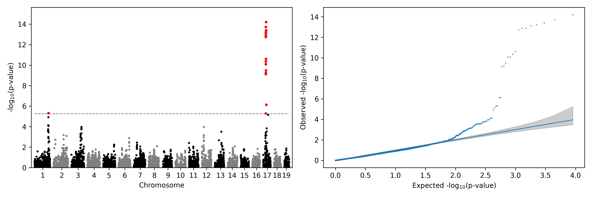

# pyBLUP

## Dependence

>python>=3.9 & <3.14 (bed_reader is not compatible with python3.14)

## Installation

```bash
pip install git+https://github.com/MaizeMan-JxFU/pyBLUP.git; cd pyBLUP
pip install . # only pyBLUP
```

## Usage

### Python package usage of GS and GWAS

>GS module

```python
from pyBLUP import BLUP,GWAS
import numpy as np
import time
np.random.seed(2025)
def GS_test() -> None:
    snp_num = 10000
    sample_num = 500
    pve = 0.5
    sigmau = 1
    x = np.zeros(shape=(sample_num,snp_num)) # 0,1,2 of SNP
    for i in range(snp_num):
        maf = np.random.uniform(0.05,0.5)
        x[:,i] = np.random.binomial(2,maf,size=sample_num)
    u = np.random.normal(0,sigmau,size=(snp_num,1)) # effect of SNP 服从正态分布
    g = x @ u
    e = np.random.normal(0,np.sqrt((1-pve)/pve*(g.var())),size=(sample_num,1))
    y = g + e
    for i in [None,'pearson','VanRanden','gemma1','gemma2']:
        _ = []
        _hat = []
        t = time.time()
        model = BLUP(y,x,kinship=i)
        print((time.time()-t)/60,'mins')
        # break
        y_hat = model.predict(x)
        _+=y.tolist()
        _hat+=y_hat.tolist()
        real_pred = np.concatenate([np.array(_),np.array(_hat)],axis=1)
        print(f'{i}({round(model.pve,3)})',np.corrcoef(real_pred,rowvar=False)[0,1])

if __name__ == "__main__":
    GS_test() # test of GBLUP and rrBLUP
```

>GWAS module

```python
import pandas as pd
import numpy as np
from pyBLUP import QK,GWAS
from gfreader import breader # https://github.com/MaizeMan-JxFU/greader.git
geno = breader('example/mouse_hs1940').iloc[:,2:].T
pheno = pd.read_csv('example/mouse_hs1940.pheno.txt',sep='\t',header=None)
qkmodel = QK(geno.values,low_memory=False)
kmatrix = qkmodel.kinship(method='gemma1')
qmatrix,eigenval = qkmodel.rpca(10)
p = pheno.iloc[:,0].values.reshape(-1,1)
retain = ~np.isnan(p).flatten()
gwasmodel = GWAS(y=p[retain,:],kinship=kmatrix[retain,:][:,retain])
results = gwasmodel.gwas(snp=geno.values[retain,:],chunksize=500_000)
print(results)
```

### CLI usage of GWAS

```shell
git clone https://github.com/MaizeMan-JxFU/pyBLUP.git; cd pyBLUP
pip install -r gwas.requirements.txt # gfreader, bioplotkit, pyBLUP for gwas cli
# python gwas.py # {plinkfile|vcffile} {phenotypefile} {outputfolder} \
# {KinshipMethod default:VanRanden} {Qdimension default:3} {Accuracy default:False}
python gwas.py example/mouse_hs1940 example/mouse_hs1940.pheno test/ VanRanden 3 True
python gwas.py example/mouse_hs1940.vcf.gz example/mouse_hs1940.pheno test/ VanRanden 3 True
```



Test data in example is from [genetics-statistics/GEMMA](https://github.com/genetics-statistics/GEMMA), published in [Parker et al, Nature Genetics, 2016](https://doi.org/10.1038/ng.3609)
